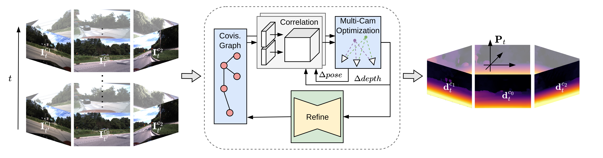

# R3D3: Dense 3D Reconstruction of Dynamic Scenes from Multiple Cameras [ICCV 2023]
### [Project Page](ToDo) | [Paper](ToDo) | [Data](https://drive.google.com/drive/folders/1KffVz7zPmcAYbZIXHH2xFoPCmcLZJfUd?usp=sharing)



<!--  **Initial Code Release:** ... -->

## Abstract

Dense 3D reconstruction and ego-motion estimation are key challenges in autonomous driving and robotics. Compared to the 
complex, multi-modal systems deployed today, multi-camera systems provide a simpler, low-cost alternative. However, 
camera-based 3D reconstruction of complex dynamic scenes has proven extremely difficult, as existing solutions often 
produce incomplete or incoherent results. We propose R3D3, a multi-camera system for dense 3D reconstruction and 
ego-motion estimation. Our approach iterates between geometric estimation that exploits spatial-temporal information 
from multiple cameras, and monocular depth refinement. We integrate multi-camera feature correlation and dense bundle 
adjustment operators that yield robust geometric depth and pose estimates. To improve reconstruction where geometric 
depth is unreliable, e.g. for moving objects or low-textured regions, we introduce learnable scene priors via a depth 
refinement network. We show that this design enables a dense, consistent 3D reconstruction of challenging, dynamic 
outdoor environments. Consequently, we achieve state-of-the-art dense depth prediction on the DDAD and nuScenes 
benchmarks.

## Getting Started
1. Clone the repo using the `--recursive` flag
```Bash
git clone --recurse-submodules https://github.com/AronDiSc/r3d3.git
cd r3d3
```

2. Creating a new anaconda environment using the provided .yaml file
```Bash
conda env create --file environment.yaml
conda activate r3d3
```

3. Compile the extensions (takes about 10 minutes)
```Bash
python setup.py install
```

## Datasets
The datasets should be placed at `data/datasets/<dataset>`
### DDAD
Download the [DDAD dataset](https://tri-ml-public.s3.amazonaws.com/github/DDAD/datasets/DDAD.tar) and place it at
`data/datasets/DDAD`. We use the [masks](https://cloud.tsinghua.edu.cn/f/c654cd272a6a42c885f9/?dl=1) provided by 
SurroundDepth. Place them at `data/datasets/DDAD/<scene>/occl_mask/<cam>/mask.png`. The DDAD datastructure should look
as follows:
```
R3D3
    ├ data
        ├ datasets
            ├ DDAD
                ├ <scene>
                    ├ calibration
                        └ ....json
                    ├ point_cloud
                        └ <cam>
                            └ ....npz
                    ├ occl_mask
                        └ <cam>
                            └ ....png
                    ├ rgb
                        └ <cam>
                            └ ....png
                    
                    └ scene_....json
                └ ...
            └ ...
        └ ...
    └ ...
```

### nuScenes
Download the [nuScenes dataset](https://www.nuscenes.org/download) and place it at
`data/datasets/nuScenes`. We use the provide self-occlusion
[masks](https://drive.google.com/uc?export=download&id=1fJ9WyIMFTAisTOebZo_Ry2_XF_Be9ZtE). Place them at 
`data/datasets/nuScenes/mask/<cam>.png`. The nuScenes datastructure should look as follows:
```
R3D3
    ├ data
        ├ datasets
            ├ nuScenes
                ├ mask
                    ├ CAM_....png
                ├ samples
                    ├ CAM_...
                        └ ....jpg
                    └ LIDAR_TOP
                        └ ....pcd.bin
                ├ sweeps
                    ├ CAM_...
                        └ ....jpg
                ├  v1.0-trainval
                    └ ...
                └ ...
            └ ...
        └ ...
    └ ...
```

## Models

### VKITTI2 Finetuned Feature-Matching
Download the weights for the feature- and context-encoders as well as the GRU from here: 
[r3d3_finetuned.ckpt](https://drive.google.com/uc?export=download&id=1d7hBQY6qu-usJPKCyGObZA3ZhPYLt1iB). Place it at:
```
R3D3
    ├ data
        ├ models
            ├ r3d3
                └ r3d3_finetuned.ckpt
            └ ...
        └ ...
    └ ...
```

### Completion Network
We provide completion network weights for the DDAD and nuScenes datasets.

| Dataset        |  Abs Rel   |  	Sq Rel   |   RMSE    |  delta < 1.25   | Download                         |
|:---------------|:----------:|:----------:|:---------:|:---------------:|:---------------------------------|
| DDAD           |   0.162    |   3.019    |  11.408   |      0.811      | [completion_ddad.ckpt](https://drive.google.com/uc?export=download&id=1e35qs83LqUYjPZaHhD1IDI_K9HlzfQEp)     |
| nuScenes       |    0.253   |   4.759    |   7.150   |      0.729      | [completion_nuscenes.ckpt](https://drive.google.com/uc?export=download&id=1cFNK8SCbVhCVkEJShrD5-3vzMVvQvpsc) |

Place them at:

```
R3D3
    ├ data
        ├ models
            ├ completion
                ├ completion_ddad.ckpt
                └ completion_nuscenes.ckpt
            └ ...
        └ ...
    └ ...
```

## Training

### Droid-SLAM Finetuning
We finetune the provided [droid.pth](https://drive.google.com/file/d/1PpqVt1H4maBa_GbPJp4NwxRsd9jk-elh/view?usp=sharing) checkpoint on [VKITTI2](https://europe.naverlabs.com/research/computer-vision/proxy-virtual-worlds-vkitti-2/) by using the [Droid-SLAM code-base](https://github.com/princeton-vl/DROID-SLAM).


### Completion Network

#### 1. Generate Training Data
```Bash
# DDAD
python evaluate.py \
    --config configs/evaluation/dataset_generation/dataset_generation_ddad.yaml \
    --r3d3_weights=data/models/r3d3/r3d3_finetuned.ckpt \
    --r3d3_image_size 384 640 \
    --r3d3_n_warmup=5 \
    --r3d3_optm_window=5 \
    --r3d3_corr_impl=lowmem \
    --r3d3_graph_type=droid_slam \
    --training_data_path=./data/datasets/DDAD 

# nuScenes
python evaluate.py \
    --config configs/evaluation/dataset_generation/dataset_generation_nuscenes.yaml \
    --r3d3_weights=data/models/r3d3/r3d3_finetuned.ckpt \
    --r3d3_image_size 448 768 \
    --r3d3_n_warmup=5 \
    --r3d3_optm_window=5 \
    --r3d3_corr_impl=lowmem \
    --r3d3_graph_type=droid_slam \
    --training_data_path=./data/datasets/nuScenes 
```

#### 2. Completion Network Training
```Bash
# DDAD
python train.py configs/training/depth_completion/r3d3_completion_ddad_stage_1.yaml
python train.py configs/evaluation/depth_completion/r3d3_completion_ddad_inf_depth.yaml --arch.model.checkpoint=<path to stage 1 model>.ckpt
python train.py configs/training/depth_completion/r3d3_completion_ddad_stage_2.yaml --arch.model.checkpoint=<path to stage 1 model>.ckpt

# nuScenes
python train.py configs/training/depth_completion/r3d3_completion_nuscenes_stage_1.yaml
python train.py configs/evaluation/depth_completion/r3d3_completion_nuscenes_inf_depth.yaml --arch.model.checkpoint=<path to stage 1 model>.ckpt
python train.py configs/training/depth_completion/r3d3_completion_nuscenes_stage_2.yaml --arch.model.checkpoint=<path to stage 1 model>.ckpt
```

## Evaluation
```Bash
# DDAD
python evaluate.py \
    --config configs/evaluation/r3d3/r3d3_evaluation_ddad.yaml \
    --r3d3_weights data/models/r3d3/r3d3_finetuned.ckpt \
    --r3d3_image_size 384 640 \
    --r3d3_init_motion_only \
    --r3d3_n_edges_max=84 

# nuScenes
python evaluate.py \
    --config configs/evaluation/r3d3/r3d3_evaluation_nuscenes.yaml \
    --r3d3_weights data/models/r3d3/r3d3_finetuned.ckpt \
    --r3d3_image_size 448 768 \
    --r3d3_init_motion_only \
    --r3d3_dt_inter=0 \
    --r3d3_n_edges_max=72 
```

## Citation
If you find the code helpful in your research or work, please cite the following paper.
```
@inproceedings{r3d3,
  title={R3D3: Dense 3D Reconstruction of Dynamic Scenes from Multiple Cameras},
  author={Schmied, Aron and Fischer, Tobias and Danelljan, Martin and Pollefeys, Marc and Yu, Fisher},
  booktitle={ICCV},
  year={2023}
}
```


## Acknowledgements
- This repository is based on [Droid-SLAM](https://github.com/princeton-vl/DROID-SLAM).
- The implementation of the completion network is based on [Monodepth2](https://github.com/nianticlabs/monodepth2).
- The [vidar](https://github.com/TRI-ML/vidar) framework is used for training, evaluation and logging results.
